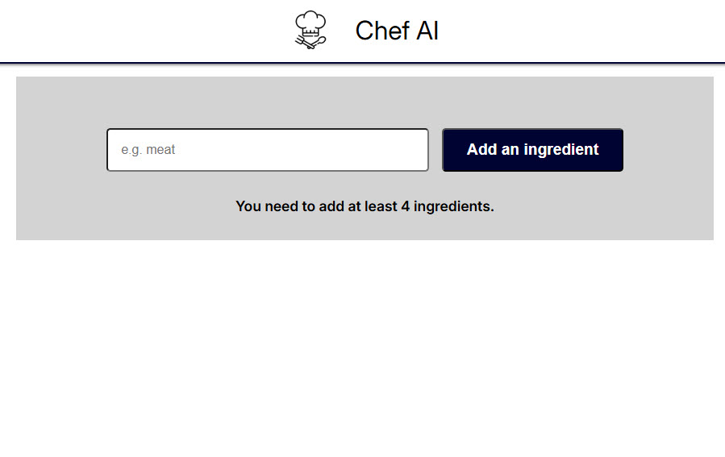
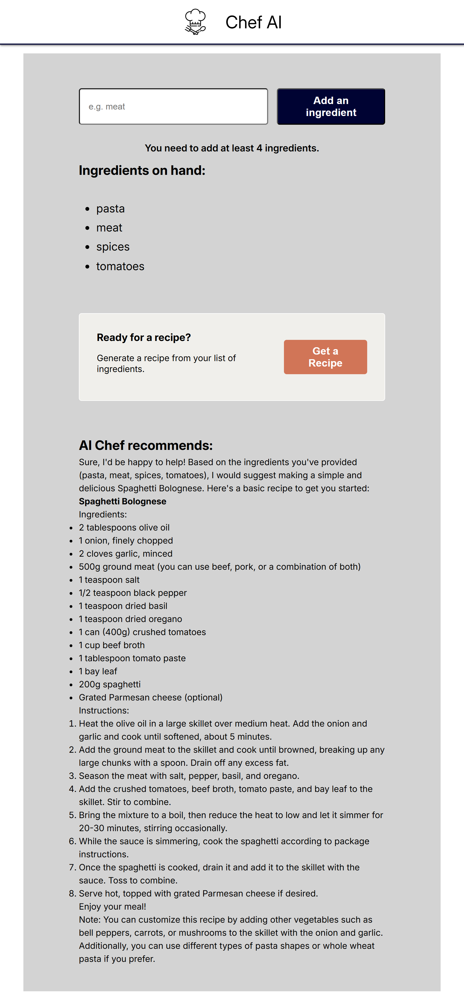

# React_Recipe_Maker
### (integrated AI challenge)
Project for Frontend Development Specialization / Scrimba

  

  

#### *** This project is designed to be used with HuggingFace *** 

1. `npm install`
2. In the root directory, create a .env file with the content:
`VITE_HF_ACCESS_TOKEN = your api key from huggingface`
3. `npm run dev`
